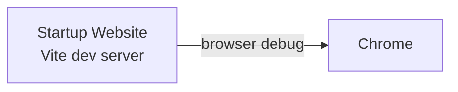

# Azure Debug Plan

> This plan is the source of truth for generating the
> VS Code debug setup in this workspace.
>
> **Status:** Implemented
> **Execution Mode:** Auto
> **Created:** 2026-09-29T00:00:00Z
> **Last Updated:** 2026-09-29T15:54:34Z

## Prerequisites

| Tool / Extension | Category | Service(s) | Installed | Version |
|------------------|----------|------------|-----------|---------|
| Node.js | Runtime | * | ✅ | v26.8.1 |
| npm | Package manager | * | ✅ | 11.19.0 |
| Vite | Build / dev server | Startup Website | ✅ | 7.3.6 |

## Debug Configurations

| Generate | Debug Config Name | Service Label | Service Root | Project Type | Runtime | Version | Azure Dependencies |
|----------|--------------------|---------------|--------------|--------------|---------|---------|---------------------|
| [x] | Startup Website (Chrome) | Startup Website | ./ | frontend-spa | node-ts | 26.8.1 | — |

ℹ️ Project Type Descriptions

| Project Type | Description |
|-------------|-------------|
| frontend-spa | Single-page React application served by a Vite development server and debugged in a browser |

## Orchestrator

No container orchestrator is required because this workspace has no Azure service dependencies or local emulators.

| Orchestrator | Container Runtime | Compose Command | Description |
|--------------|-------------------|-----------------|-------------|
| Not required | — | — | The static frontend runs directly through Vite. |

## Emulators

No emulators are required.

| Dependent Service | Emulator | Purpose |
|-------------------|----------|---------|
| None | None | No Azure-connected service is present. |

## Architecture Diagram

During debugging, VS Code starts the Vite development server with the existing `npm run dev` script and opens the site in Chrome; no Azure emulator or external service is involved.

## API Test Collections

No API test collection is required. The project exposes client-side routes only and has no registered HTTP API endpoints or triggers.

## Convenience Scripts

The existing scripts are sufficient for local development and verification; no emulator lifecycle scripts need to be generated.

| Generate | Script | Registered In | Description |
|----------|--------|---------------|-------------|
| [ ] | dev | ./package.json | Starts the Vite development server. |
| [ ] | test | ./package.json | Runs the Vitest test suite. |
| [ ] | build | ./package.json | Type-checks and builds the production bundle. |

## Debug Configuration Checklist

Debug Configuration Checklist:
✅ Startup Website (Chrome) — Vite emitted `VITE` and `Local:` ready signals; `http://localhost:5173/` returned HTTP 200; validation server stopped and port 5173 was released.